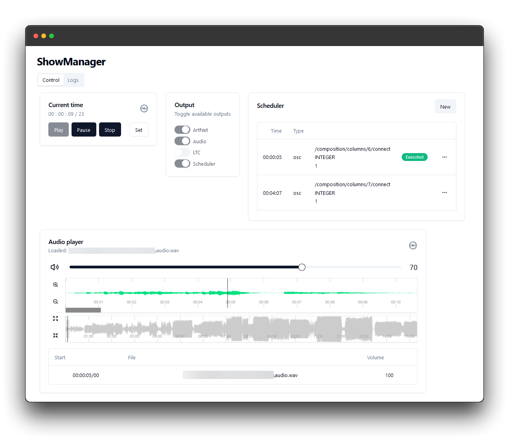

# ShowManager [](https://github.com/MrExplode/ShowManager/actions) [](https://www.codacy.com/gh/MrExplode/ShowManager/dashboard?utm_source=github.com&amp;utm_medium=referral&amp;utm_content=MrExplode/ShowManager&amp;utm_campaign=Badge_Grade) [](https://app.codecov.io/gh/MrExplode/ShowManager)
This project aims to be the "brain" of a prerecorded show by playing Art-Net timecode, sending scheduled OSC messages and playing audio tracks synced to timecode.



## About
Please note that this is a hobby project of mine, and it is WIP. Only `wav` files are supported. Some options can be only changed from the configuration file, notably
 - Audio output
 - Audio tracks

### Features
- [x] Art-Net timecode generator
- [ ] LTC timecode generator
- [ ] MIDI timecode generator
- [x] Timecode triggered OSC message sending
- [x] Timecode triggered audio track player
- [x] Web user interface
- [ ] Selectable output destination (eg. client1 plays Art-Net, client2 plays audio, and so on)

## Building

### ShowManager
You can build the Java artifact with:
```shell
./gradlew build
```
the artifact will be in `build/libs`  

### UI
ShowManager uses a [web UI](webapp). In order to use you have to build it first, using standard [web tooling](https://pnpm.io).

```bash
# First setup
pnpm install
```
```bash
pnpm run build
```

After setting up the project with `pnpm install`, you can use the `build-webapp` gradle task for building. It runs the pnpm
build command internally.
```bash
# example full clean build, without tests
./gradlew clean build build-webapp -x test
```

Set the `build` folder's path to the environment value `showmanager.dist`

# Usage
Run the java artifact with:
```shell
java -jar ShowManager-<version>.jar
```
On the first run, ShowManager will create an empty config file. You may close ShowManager, as you probably want to configure some settings.
The project json file is located at `%APPDATA%/ShowManager/projects`.
You have to set the audio output, and add your tracks. Example:
```json
"audio-player": {
  "enabled": false,
    "mixer": "Speakers (Realtek(R) Audio)",
    "tracks": [
      {
        "startTime": {
          "hour": 0,
          "min": 1,
          "sec": 5,
          "frame": 0
        },
        "file": {
          "path": "path/to/file.wav"
        },
        "volume": 1.0,
        "markers": []
      },
      {
        "startTime": {
          "hour": 0,
          "min": 10,
          "sec": 0,
          "frame": 0
        },
        "file": {
          "path": "path/to/other_file.wav"
        },
        "volume": 1.0,
        "markers": []
      },
    ]
  }
```

Run again, and open the web UI on the host+port that's specified in the project settings. It defaults to `http://127.0.0.1:7000`.

