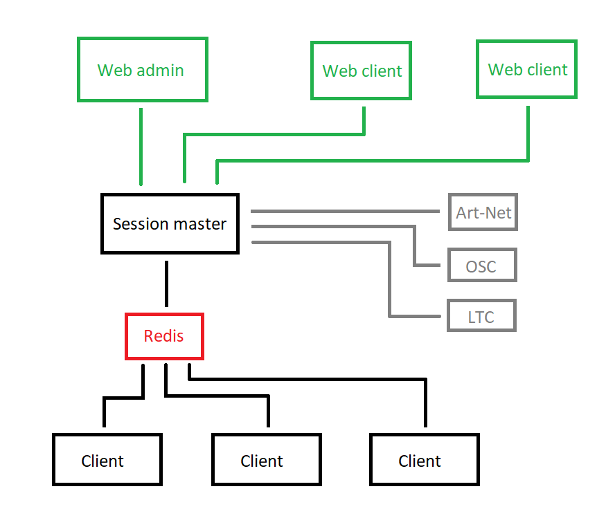

#   ShowManager  
ArtNet and LTC timecode generator.

## About
You can see the planned project layout above.

### Features
 - Art-Net timecode generator
 - LTC timecode generator
 - MIDI timecode generator (maybe)
 - Timecode triggered OSC message sending
 - Timecode triggered audio track player
 - Web user interface
 - Selectable output destination (eg. client1 plays Art-Net, client2 plays audio, and so on)